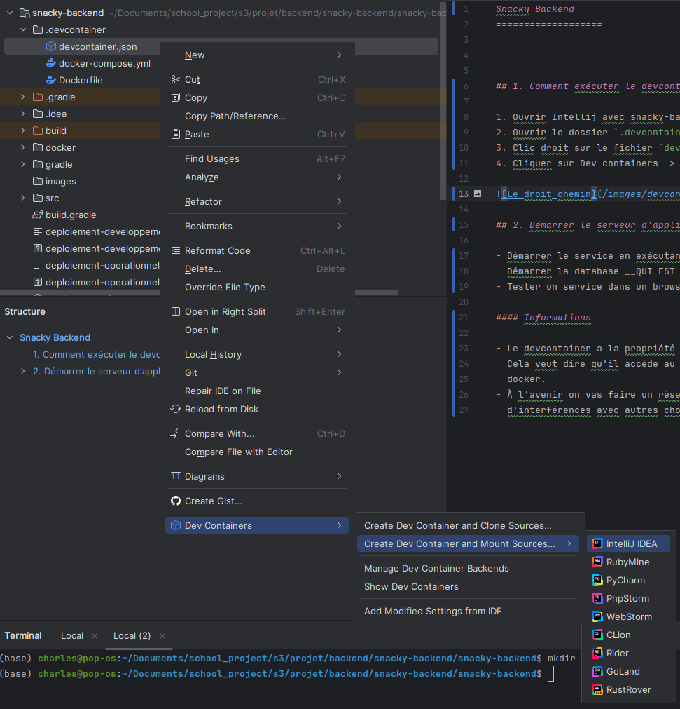

Snacky Backend 
===================

## 1. Comment exécuter le devcontainer

1. Ouvrir Intellij avec snacky-backend comme dossier de projet
2. Ouvrir le dossier `.devcontainer`
3. Clic droit sur le fichier `devcontainer.json`
4. Cliquer sur Dev containers -> Create dev containers and mount sources -> Intellij Idea

## 2. Démarrer le serveur d'application

- Démarrer le service en exécutant le snacky-backend.main dans  intellij
- Démarrer la database __QUI EST DANS LE REPO DATABASE__
- Tester un service dans un browser : localhost:8888/api/getusager/1

#### Informations

- Le devcontainer a la propriété présentement d'avoir le meme réseau que son host (votre ordi).
  Cela veut dire qu'il accède au restes des services en passant par votre réseau et non un réseau
  docker.
- À l'avenir on vas faire un réseau docker pour les devcontainer pour s'assurer de pas avoir
  d'interférences avec autres choses sur le réseau de l'ordinateur.
